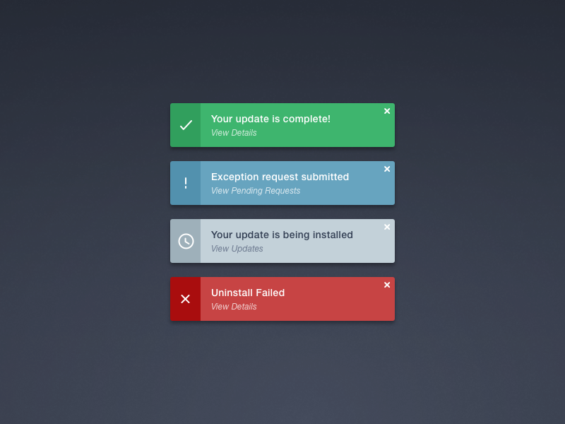

# ez-alert
Alert web component with configurable options

### Demo

[Click here for a live demo](http://tjtc.me/ez-alert)

#### UI Inspired by [John Oddo](https://dribbble.com/shots/2689073-Simple-Growl-Notification)

#### Built with:
  * Web Component Spec
  * CSS & HTML
  * Webpack

### Setup & Build
  * `npm i` - install it!
  * `npm run dev` - local development
  * `npm run build` - built for publishing
